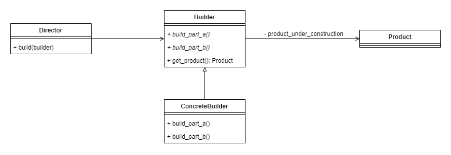
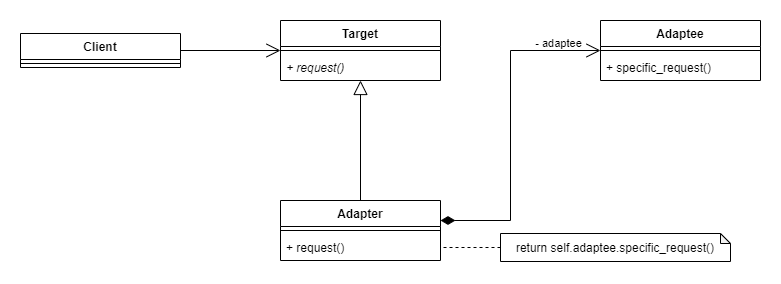
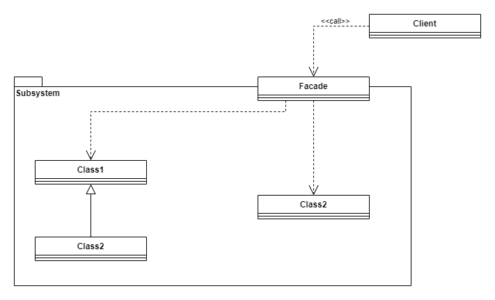
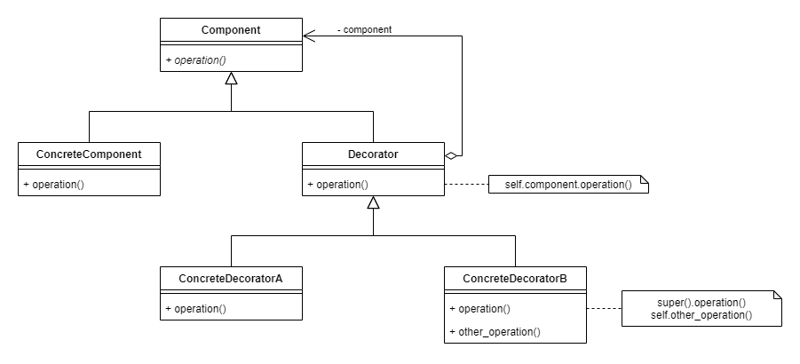
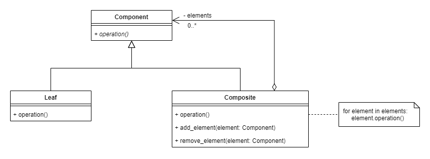
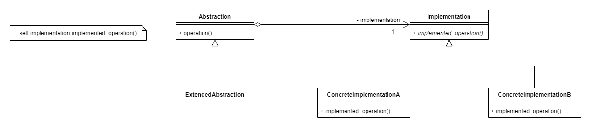
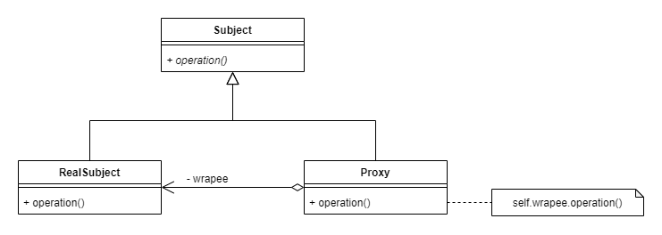

# Design-Patterns

## Creational patterns

### Singleton
Ensures that a class has only one instance and provides a global point of access to it.

### Prototype
Specify the kinds of objects to create using a prototypical instance, and create new objects by copying this prototype.

### Factory Method
Define an interface to create an object, but let the subclasses decide the class to instantiate. The instantiation is delegated to the subclasses.

### Abstract Factory
Provide an interface for creating families of related or dependent objects without specifying their concrete classes.

### Builder
Separate the construction of a complex object from its representation so that the same construction process can create different representations.

<!--
### Object Pool
-->

## Structural patterns

### Adapter
Convert the interface of a class into another interface clients expect. Adapter lets classes work together that couldn't otherwise because of incompatible interfaces.

### Facade
Provide a unified interface to a set of interfaces in a subsystem. Facade defines a higher-level interface that makes the subsystem easier to use.

### Decorator
Attach additional responsibilities to an object dynamically. Decorators provide a flexible alternative to subclassing for extending functionality.

### Composite
Compose objects into tree structures to represent whole-part hierarchies. Composite lets clients treat individual objects and compositions of objects uniformly.

### Bridge
Decouple an abstraction from its implementation so that the two can vary independently.

### Proxy
Provide a surrogate or placeholder for another object to control access to it.

<!--
### Flyweight
### Private Class Data

## Behavioral patterns

### Iterator
### Command
### Observer
### Mediator
### State
### Strategy
### Template method
### Chain of responsibility
### Memento
### Null Object
### Visitor
-->