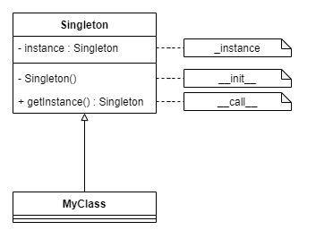

# Design-Patterns

## Creational patterns

### Singleton
Ensures that a class has only one instance and provides a global point of access to it.

<!--
### Prototype
### Factory Method
### Abstract Factory
### Builder
### Object Pool

## Structural patterns

### Adapter
### Facade
### Decorator
### Composite
### Bridge
### Proxy
### Flyweight
### Private Class Data

## Behavioral patterns

### Iterator
### Command
### Observer
### Mediator
### State
### Strategy
### Template method
### Chain of responsibility
### Memento
### Null Object
### Visitor
-->